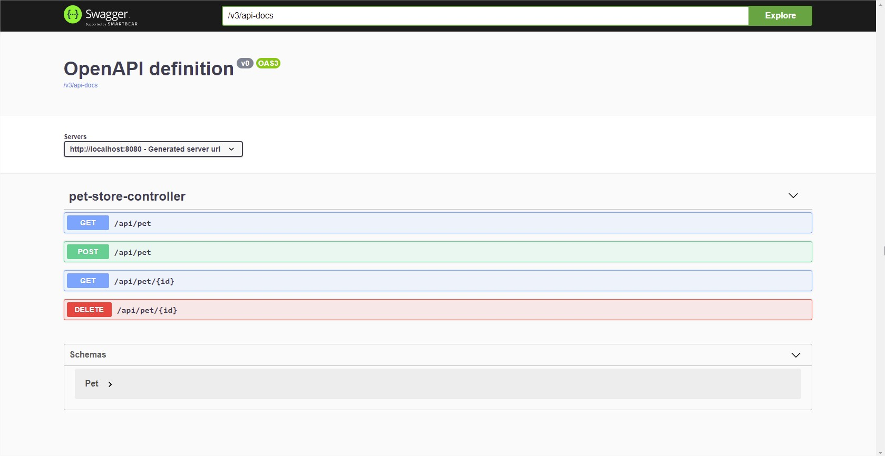
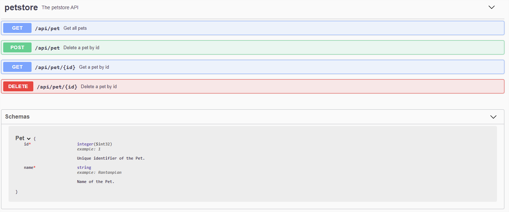

# Training Spring Cloud

## General Links

- Open API 3 : http://spec.openapis.org/oas/v3.0.3

- Open API Tools Generators : https://github.com/OpenAPITools/openapi-generator/tree/master/docs/generators
- Open API Tools Spring Generator : https://github.com/OpenAPITools/openapi-generator/blob/master/docs/generators/spring.md
- Open API Generator website : https://openapi-generator.tech/docs/generators/spring/

- Springdoc : https://springdoc.org/
  
- OpenFeign : https://github.com/OpenFeign/feign
- Spring Cloud OpenFeign : https://spring.io/projects/spring-cloud-openfeign

- Spring Cloud Contract : https://spring.io/projects/spring-cloud-contract

# Project

## General dependencies

- Spring boot (2.4.2) : https://spring.io/guides/gs/spring-boot/
- Spring cloud (2020.0.1) : https://spring.io/projects/spring-cloud/

## Producer

- Spring doc Open API 3 : https://springdoc.org/ 
    - Default url : http://localhost:8080/v3/api-docs/
    - UI on local api : http://localhost:8080/swagger-ui/index.html?configUrl=/v3/api-docs/swagger-config

- Open API Generator maven plugin : https://github.com/OpenAPITools/openapi-generator/tree/master/modules/openapi-generator-maven-plugin
  
## Contract

- Contract DSL : https://cloud.spring.io/spring-cloud-contract/reference/html/project-features.html#contract-dsl

## Consumer

- Open API Generator maven plugin : https://github.com/OpenAPITools/openapi-generator/tree/master/modules/openapi-generator-maven-plugin
- Spring cloud feign : https://cloud.spring.io/spring-cloud-netflix/multi/multi_spring-cloud-feign.html

## Mocks

# Create parent project

1. New parent pom, properties, dependency management, plugin management

# Creating the producer

1. New java module
2. Create spring boot application with starter web
3. Create model and simple controller
4. Add springdoc dependency

5. Add document annotation

# Creating the contract

1. New java module
2. Create spring boot application with wiremock and contract spec 
3. Create custom application to be able to run the generated mock from spring boot jar classpath
4. Create contracts
   https://cloud.spring.io/spring-cloud-contract/reference/html/project-features.html#contract-dsl

# Creating the client

1. New java module
2. Add open feign dependency
3. Add openapi-generator-maven-plugin (https://github.com/OpenAPITools/openapi-generator/blob/master/modules/openapi-generator-maven-plugin/README.md)

# Creating the consumer

1. New java module
2. Create spring boot application
3. Add client dependency
4. Add stub runner
5. Create the tests

# Enrich producer tests

1. Add spring-cloud-contract-maven-plugin
2. Configure it with basetests